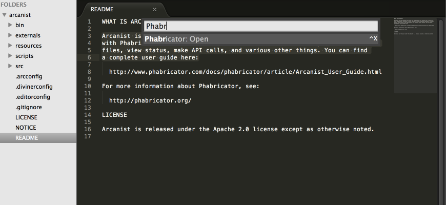
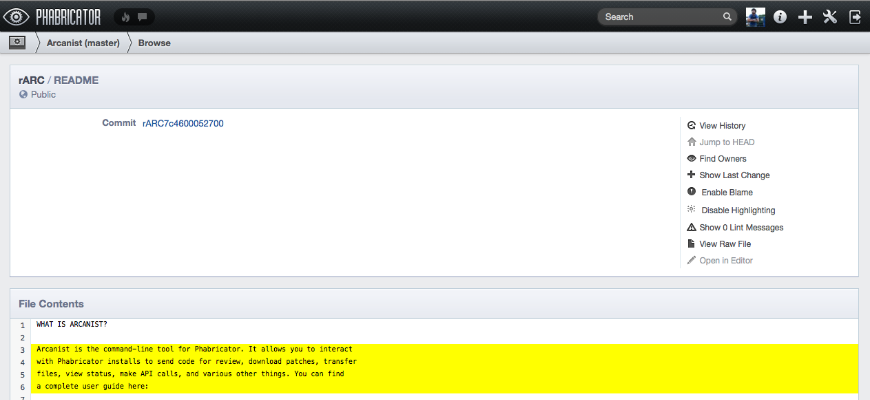

# sublime-phabricator

Open files in [Phabricator][] via [Sublime Text][]

This was built to remove the inconvenience of switching to CLI and losing the context of line numbers. It is strongly inspired by [GitHubinator][].

[Phabricator]: http://phabricator.org/
[Sublime Text]: http://sublimetext.com/
[GitHubinator]: https://github.com/ehamiter/ST2-GitHubinator





## Getting Started
### Installation
This package is available under `phabricator` inside of [Package Control][], a [Sublime Text][] plugin that allows for easy management of other plugins.

[Sublime Text]: http://www.sublimetext.com/
[Package Control]: http://wbond.net/sublime_packages/package_control

If you prefer the manual route, you can install the script via the following command in the Sublime Text terminal (``ctrl+` ``) which utilizes `git clone`.

```python
import os; path=sublime.packages_path(); (os.makedirs(path) if not os.path.exists(path) else None); window.run_command('exec', {'cmd': ['git', 'clone', 'https://github.com/twolfson/sublime-phabricator', 'phabricator'], 'working_dir': path})
```

Packages can be uninstalled via "Package Control: Remove Package" via the command pallete, `ctrl+shift+p` on Windows/Linux, `command+shift+p` on Mac.

### Configuration
Set your preferences by going to `Preferences -> Package Settings -> Phabricator -> Settings - User`. Be sure to set `arc_path` to the absolute path to `arc` in your system.

Set `branch` to the branch in the repo you want to view files on.

If you would like the plugin to just use the `arc.land.onto.default` value from the arc config for the current project,
you can leave the branch key unset and instead set `branch_use_arc_land_onto_default` to `True`.

If neither the `branch` or the `branch_use_arc_land_onto_default` keys are set, the branch you are currently on is used.

For example, your configuration on Mac OS X may be:
```json
{
  "arc_path": "/usr/local/bin/arc",
  "branch": "master"
}
```

## Documentation
We provide a single command via the command pallete.

### Phabricator: Open
Open the current file inside of Phabricator. The first selected area will be highlighted in the open window.

This command can be accessed as `phabricator_open` via `run_command`.

## Contributing
In lieu of a formal styleguide, take care to maintain the existing coding style. Add unit tests for any new or changed functionality.

## License
Copyright (c) 2014 Uber

Licensed under the MIT license.
